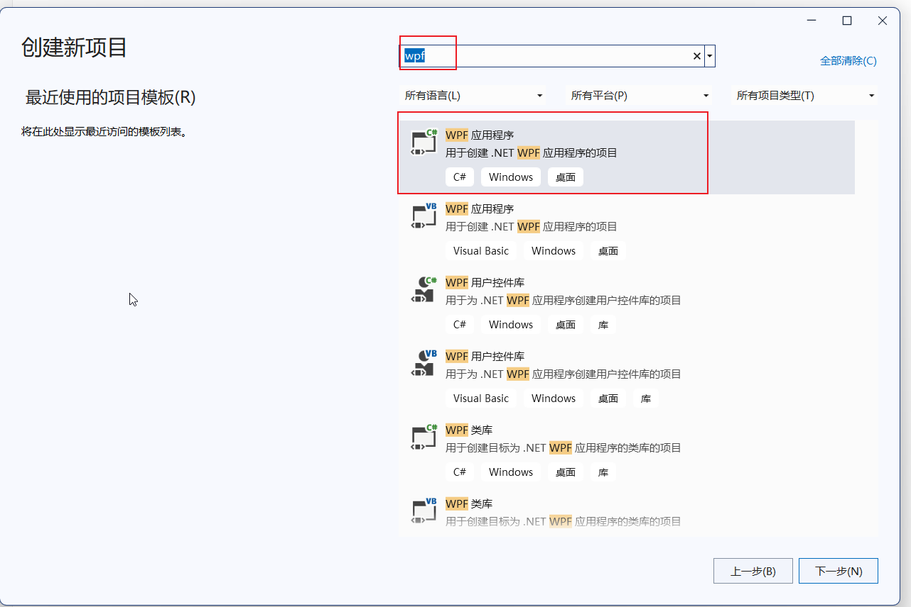
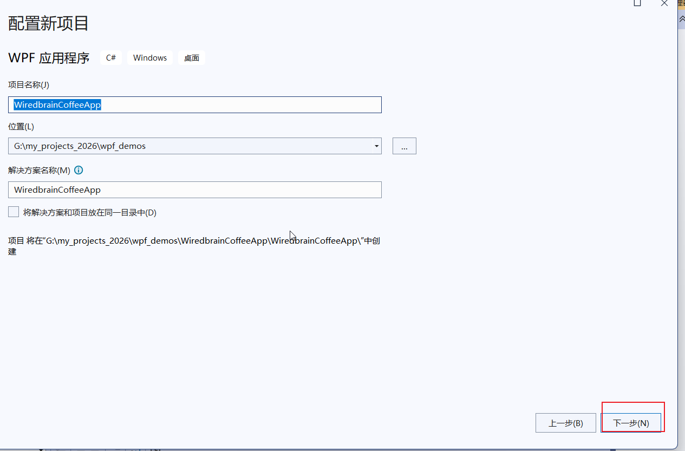
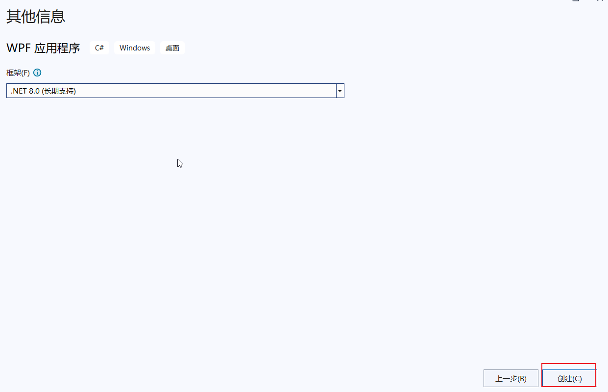
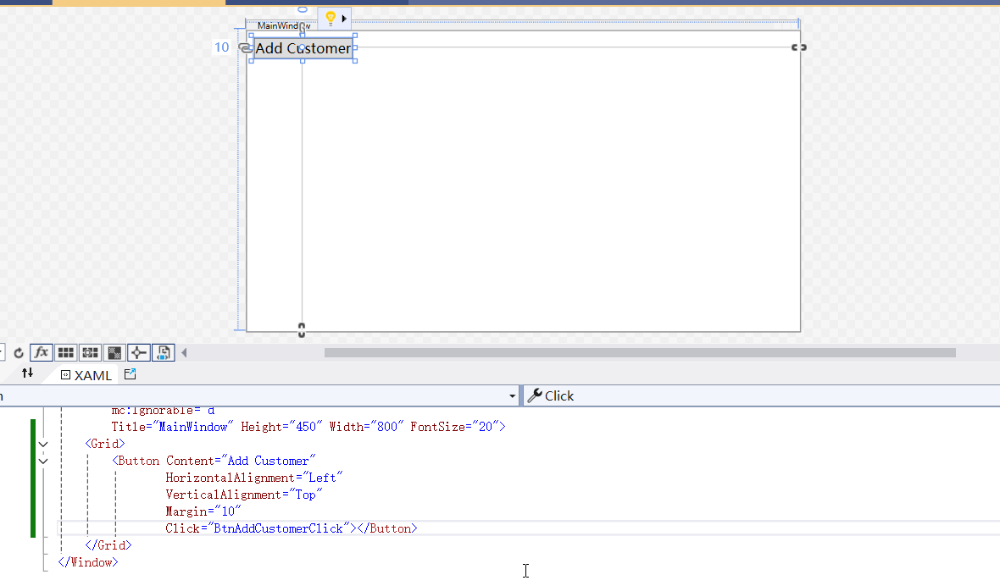
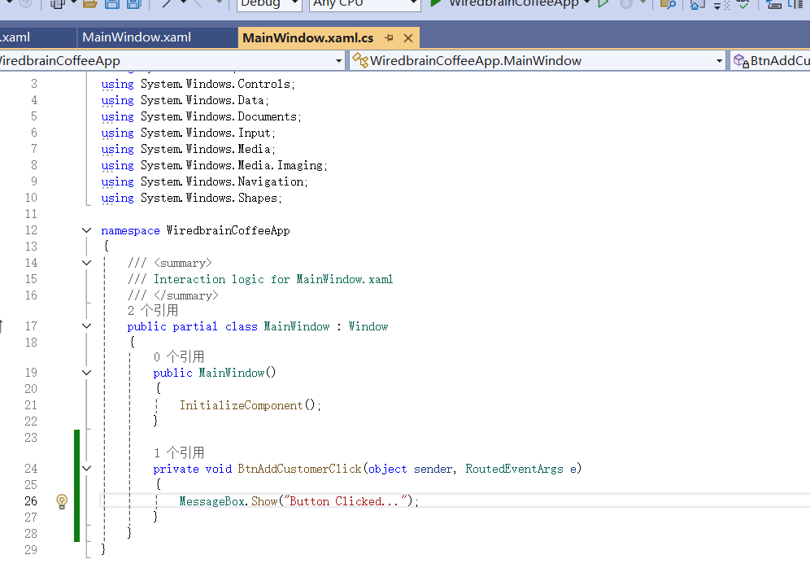
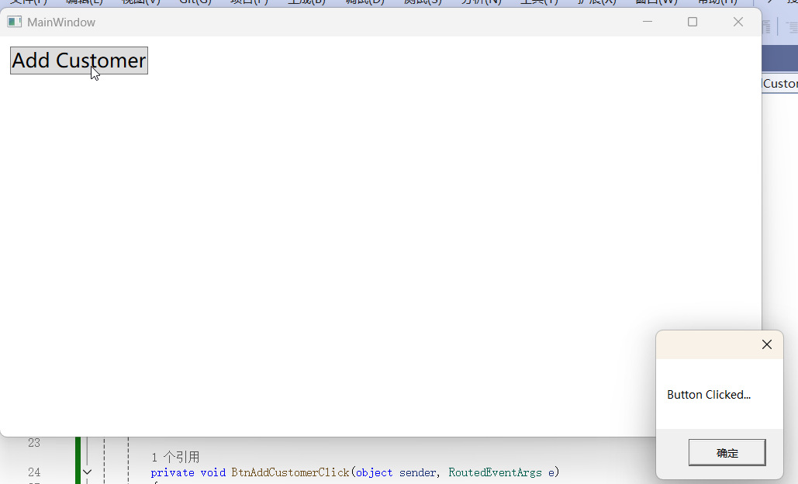

###  打开vs2022，点击新建项目，在弹出界面中输入wpf，然后选择WPF应用程序，点击下一步

### 输入项目名称：WiredBrainCoffeeApp，选择保存位置，然后点击下一步

###  点击创建，完成项目的创建

### 我们打开MainWindow.xaml,添加一个按钮，并且给他添加一个点击事件处理函数：BtnAddCustomerClick,界面的用法有点像qml，也是可以设置位置和间距的。

### 然后我们转到MainWindow.xaml.cs也就是后台代码，给我们的事件处理函数添加代码

#### 运行效果：

