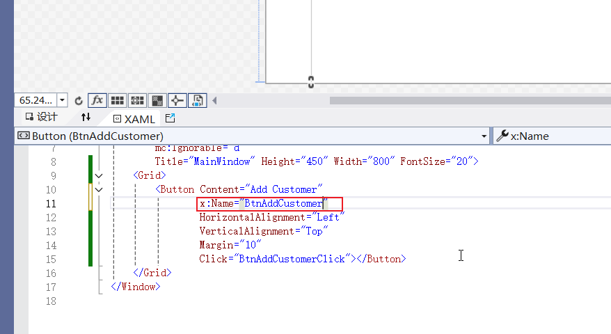
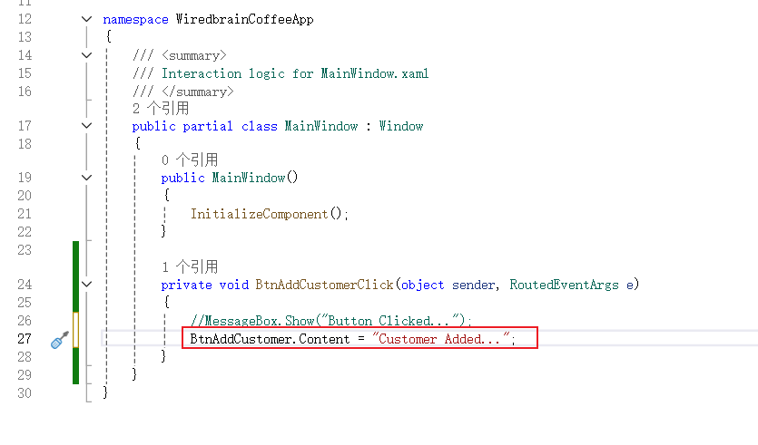
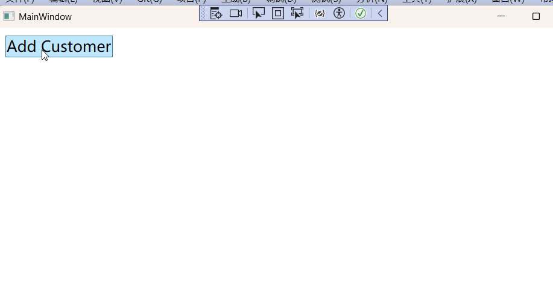
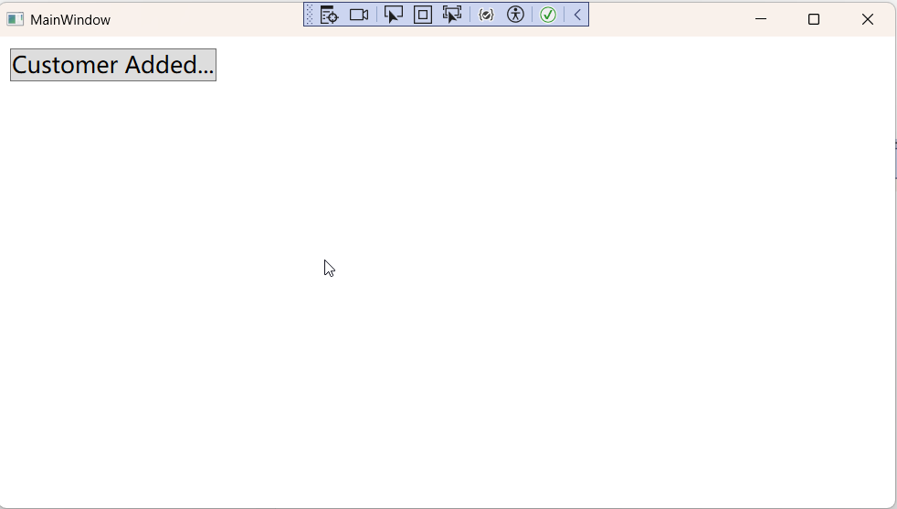
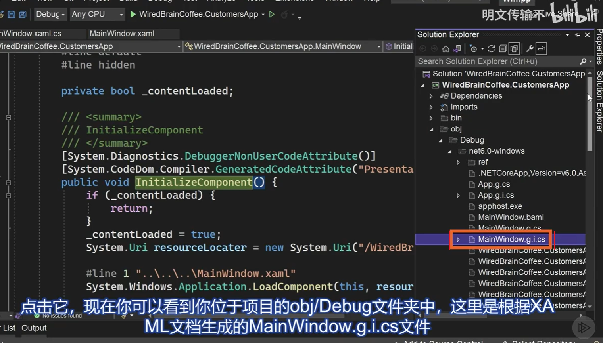
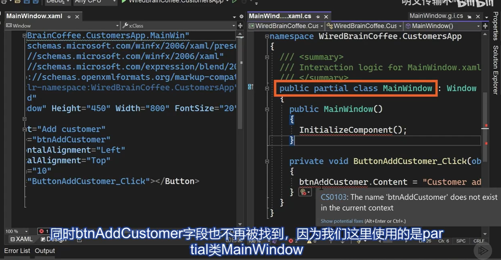
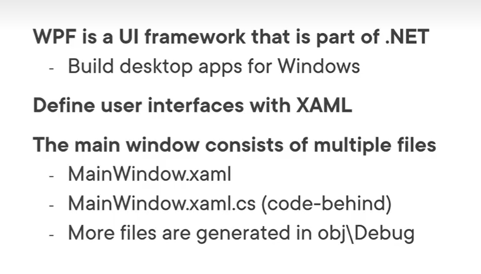

## 上一节课我们创建了一个WiredBrainCoffeeApp应用程序，并且给他添加了一个按钮并且给按钮添加点击事件处理程序。

### 现在我们就来学习如何让后台代码获取到xaml文件里面的控件，其实也蛮简单，就是在xaml文件中给控件添加一个x:Name=“xx”属性

### 然后，我们在后台代码中修改按钮的文本

#### 效果：点击之前

#### 点击之后

### 你可能会觉得奇怪，我们没有在后台代码中声明按钮，有没有声明这个InitializeComponent();为什么编译能够通过？

#### 那是因为在编译的时候，编译器会帮我们生成一些文件，在这些文件里面会进行相关的定义

### 注意：编译擅自修改xaml文件里面定义的类的名称，这样子会引起错误！！！

#### 因为你修改了名称后xaml里面的类和后台文件的类就不是同一个类的部分类，他们无法合并

## 小结

