# 1.内容提要

# 2.理解wpf中的灵活内容模型

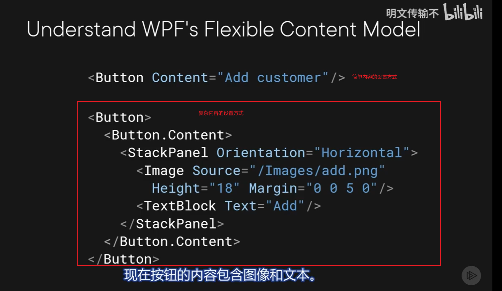

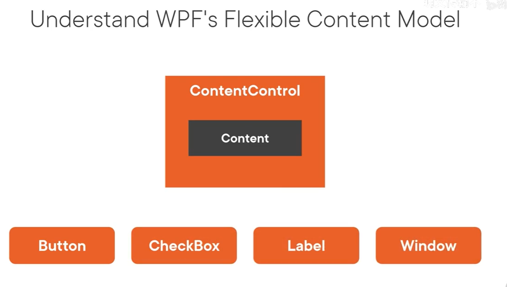

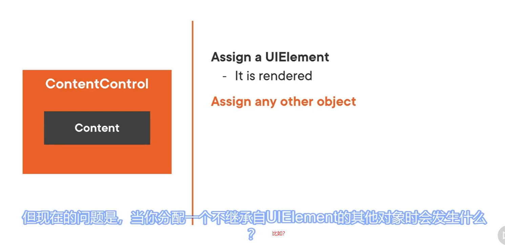

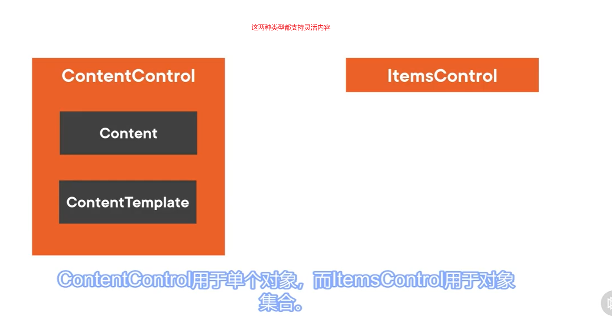

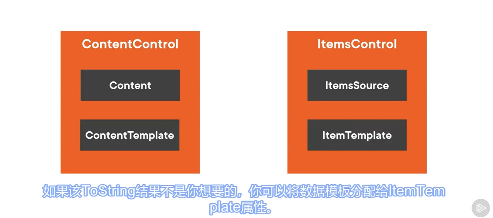

# 3.使用DataTemplate与ItemControls

## 1.打开CustomersView.xaml文件，我们给客户列表这个ListView添加一个ItemTemplate，然后在里面添加一个数据模板，我们把客户的名和姓都显示出来

### 运行程序，效果如下

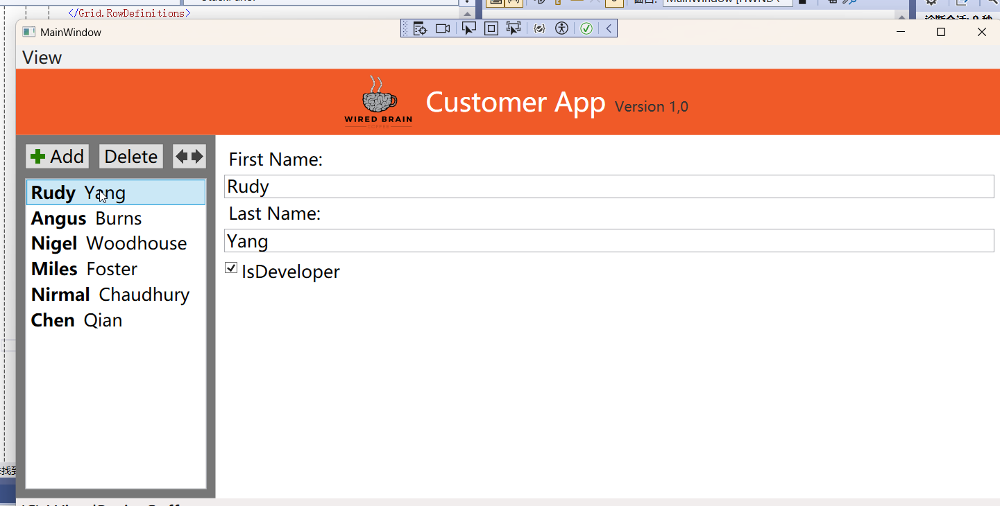

## 2.我们还可以把这个模板设置为资源，我们把数据模板从ListView里面剪切然后粘贴到UserControl.Resources标签里面，注意，此时是不需要ItemTemplate的，但是需要给他添加一个key

##  3.然后我们在ListView中使用这个资源

## 运行程序，一切正常

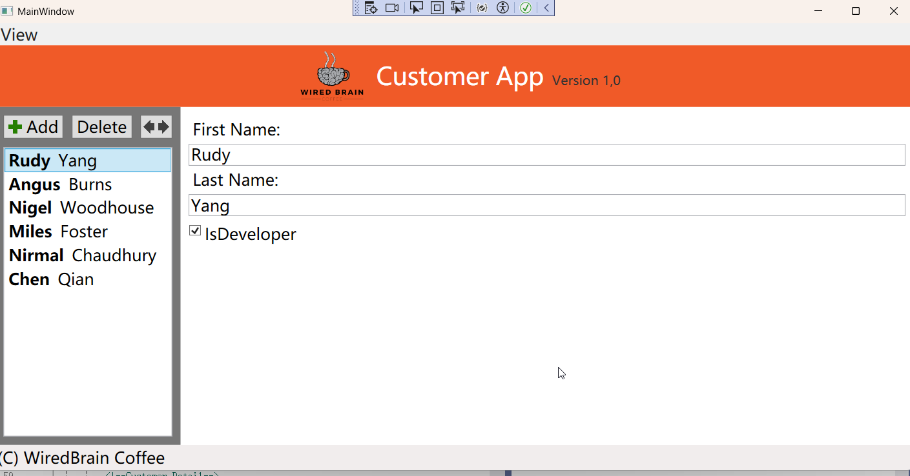

### 此时这个程序有一个小问题，就是当客户的姓名长度改变时，左边导航条的宽度会跟着改变，我们需要把导航条的宽度固定，然后显示滚动条。这是有Grid的列的宽度="auto"引起的。

# 4.设置导航区域为固定宽度

## 回到CustomerView.xaml,我们把Grid第一列的宽度设置为固定的260

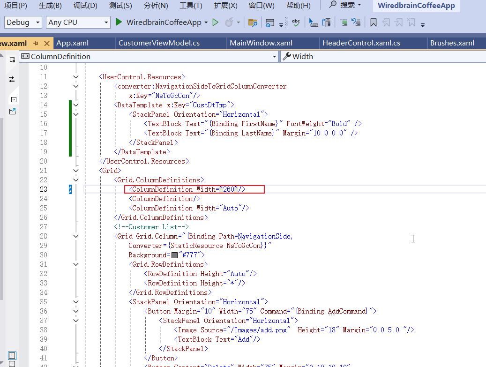

### 此时你运行应用程序，发现导航区域宽度不变，但是当内容显示不下时会程序滚动条

### 注意：这里又会有一个小问题，当你把导航区域移动到右边，左边就会有一个空白，怎么办？

## 其实我们不应该在列上面设置宽度，我们需要它为"Auto",我们把它改回来

## 我们应该设置客户列表对应的Grid的宽度为固定

# 5.使用ContentControl的设计思路

## 我们将要添加一个MainWindow视图模型。把它作为MainWindow的DataContext，用它来协调不同视图的显示，因为我们还会有产品视图

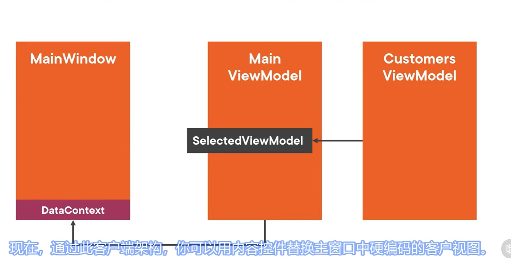

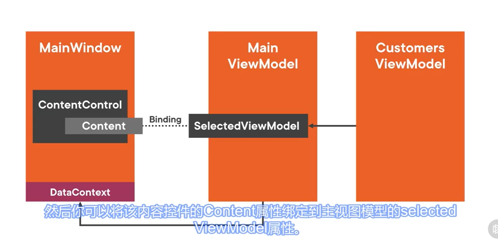

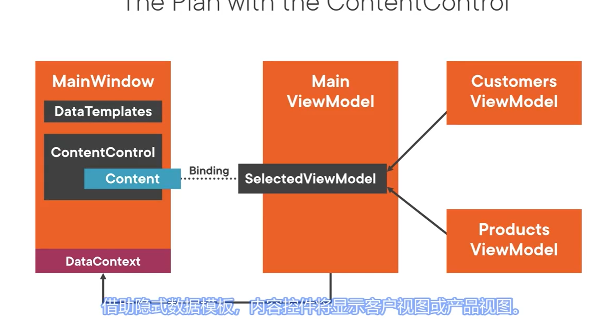

# 6.实现MainViewModel

# 7.绑定到MainViewModel

# 8.使用DataTemplate与ContentControls

# 9.理解隐式DataTemplate

# 10.引入另外一个详情视图

# 11.创建SelectViewModelCommand

# 12.将菜单项绑定到命令

