# 1.课程大纲

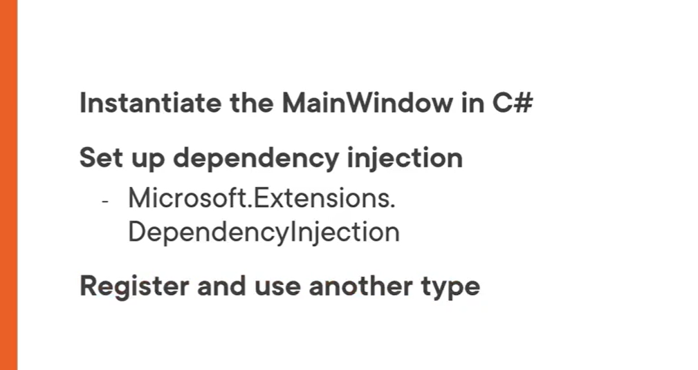

# 2.在c#代码在实例化主窗口

## 打开我们的项目，打开App.xaml,可以看到Application标签有一个属性： StartupUri="MainWindow.xaml"，它指向我们的主窗口的界面文件。

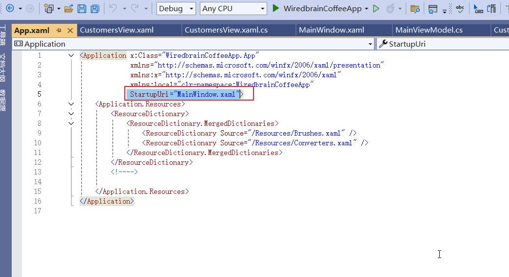

### 但是如果你需要在程序中使用依赖注入，我们需要用c#代码来创建主窗口的实例

## 我们把这个属性删除

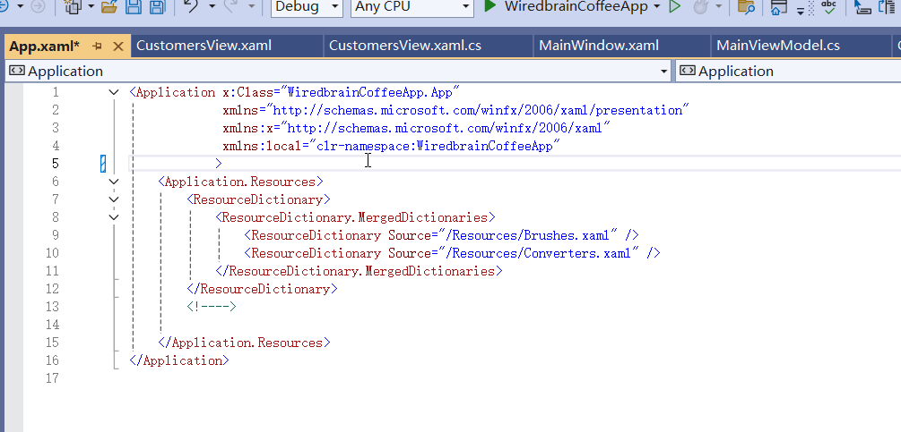

## 然后我们进入App.xaml.cs代码中，重写OnStartup方法，在里面调用玩基类的OnStartup方法后，创建一个MainWindow类的实例标签调用他的Show方法来显示窗口

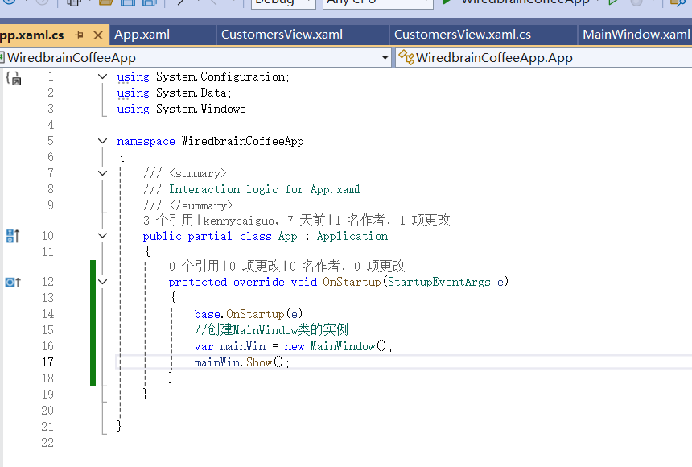


## 运行程序，一切正常

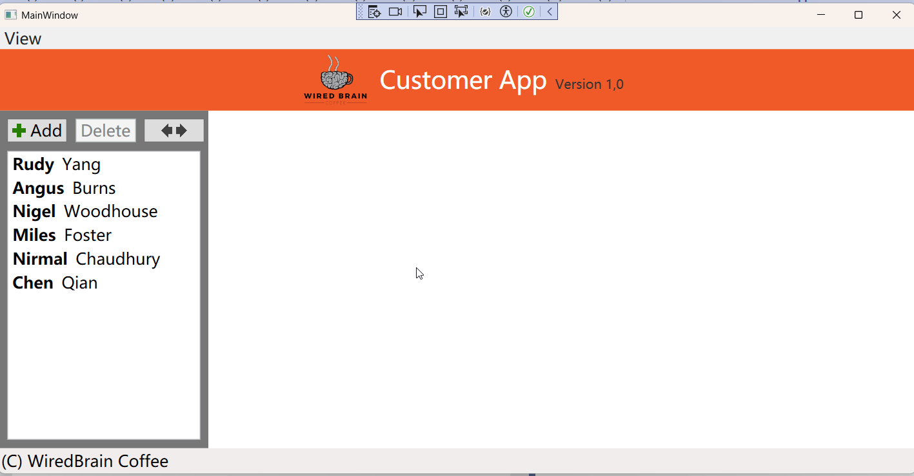

## 我们回到MainWindow.xaml.cs,修改MainWindow的构造函数的参数

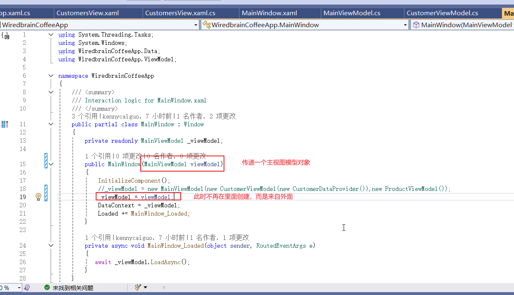

## 然后我们回到App.xaml.cs，修改一下创建主窗口的代码

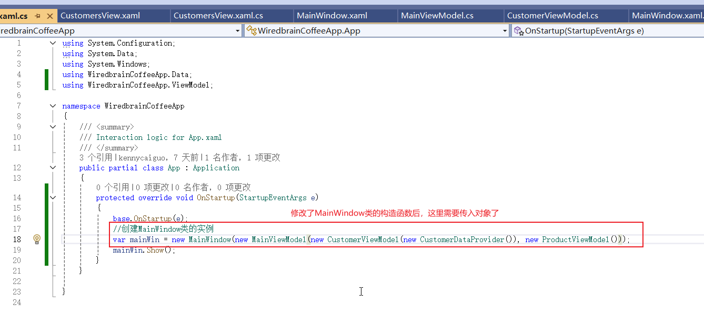

## 运行程序，一切正常

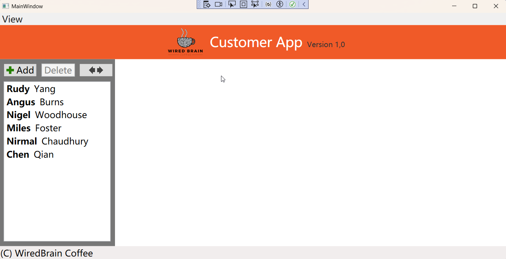

## 注意，这种方式还是不够好，我们下一节会学习如何使用依赖注入来实现


# 3.设置依赖注入

## 1.我们在项目的依赖项文件夹上面点击右键-》管理nuget程序包

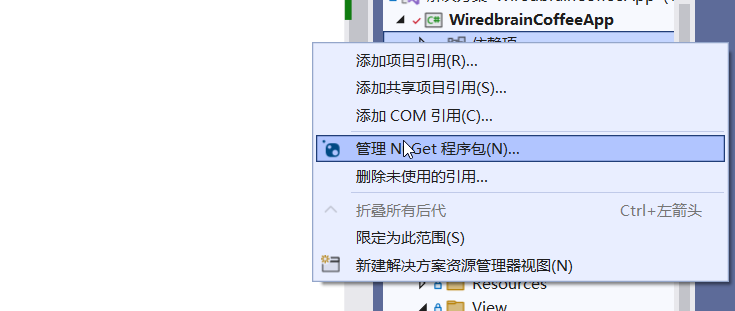


## 2.点击浏览选项卡，然后在搜索框里面输入：dependencyinject，然后选择：Microsoft.Extensions.DependencyInjection，选择6.0.0版本，然后点击安装

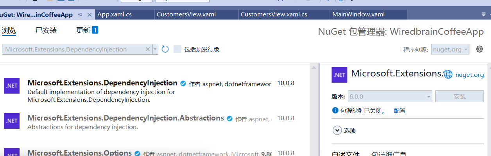

## 3.在弹出的窗口中点击应用

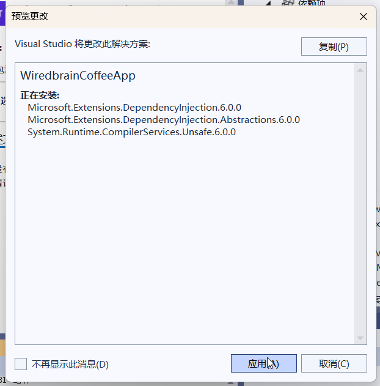

## 4.然后就安装好了，注意版本太高可能不能使用。

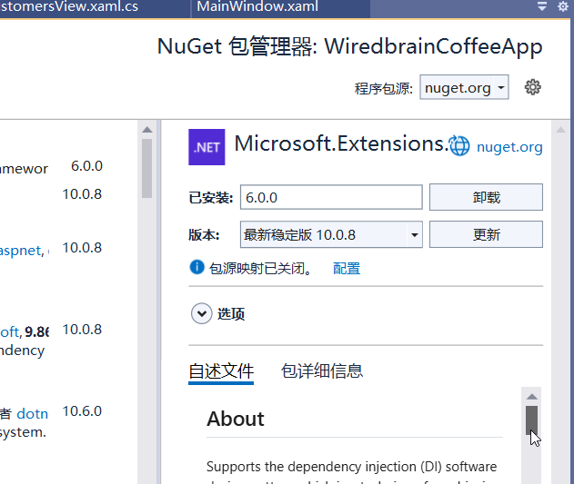

## 5.回到App.xaml.cs中，给App类创建一个构造函数，在里面创建一个ServiceCollection对象（需要引入我们上面的包），然后把它作为参数传递给还没有创建的方法ConfigureServices，然后我们创建这个方法

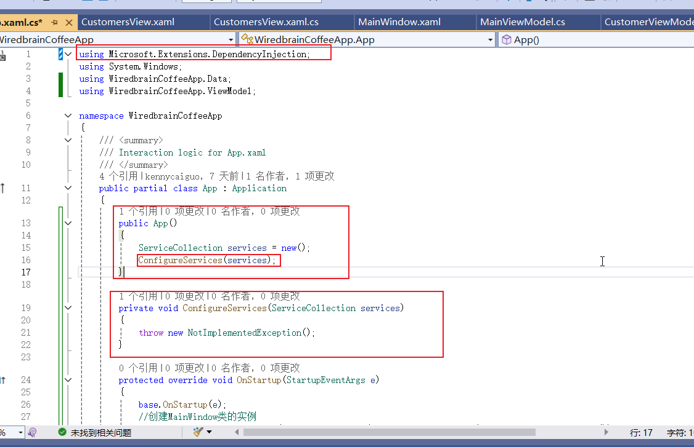

## 6.我们在ConfigureServices方法在注册所有我们需要的依赖项

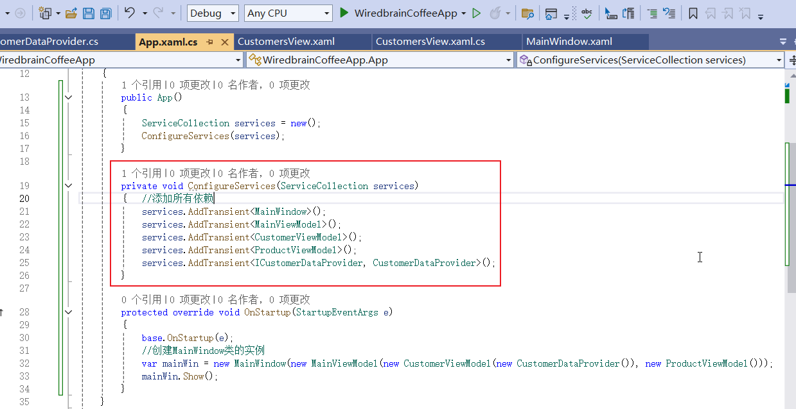

## 7.回到App类的构造函数，添加一个ServiceProvider类型的只读字段 _serviceProvider并且接受services对象的BuildServiceProvider()方法的返回值

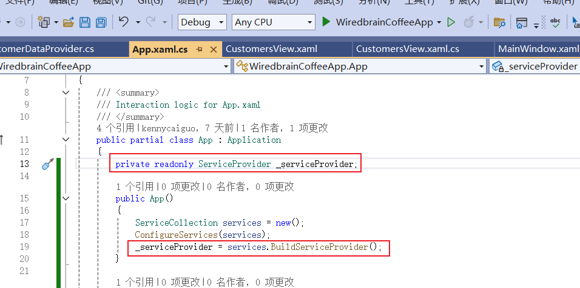

## 然后我们来修改一下创建主窗口的代码，用这个访问提供对象的getService方法来创建对象

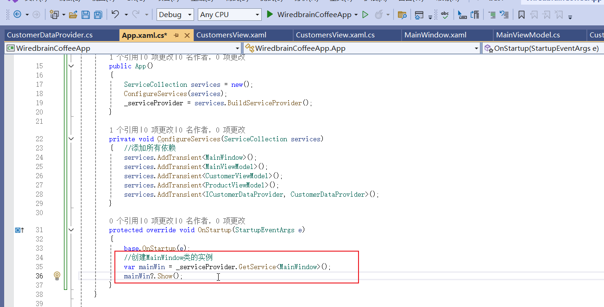

## 运行程序一切正常

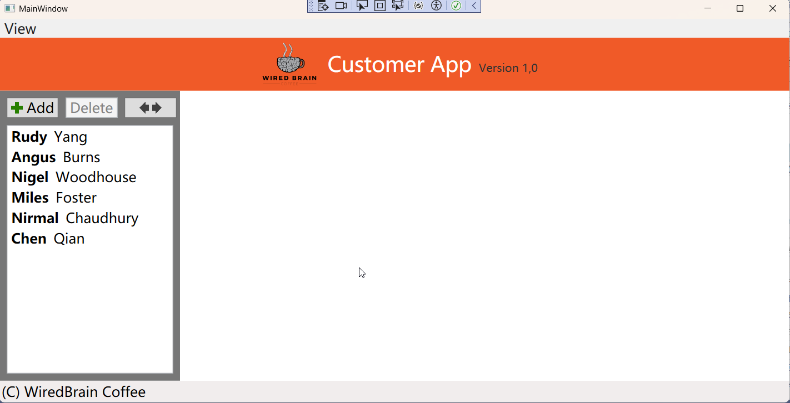

## App.xaml.cs的完整代码如下

```
using Microsoft.Extensions.DependencyInjection;
using System.Windows;
using WiredbrainCoffeeApp.Data;
using WiredbrainCoffeeApp.ViewModel;

namespace WiredbrainCoffeeApp
{
    /// <summary>
    /// Interaction logic for App.xaml
    /// </summary>
    public partial class App : Application
    {
        private readonly ServiceProvider _serviceProvider;

        public App()
        {
            ServiceCollection services = new();
            ConfigureServices(services);
            _serviceProvider = services.BuildServiceProvider();
        }

        private void ConfigureServices(ServiceCollection services)
        {   //添加所有依赖
            services.AddTransient<MainWindow>();
            services.AddTransient<MainViewModel>();
            services.AddTransient<CustomerViewModel>();
            services.AddTransient<ProductViewModel>();
            services.AddTransient<ICustomerDataProvider, CustomerDataProvider>();
        }

        protected override void OnStartup(StartupEventArgs e)
        {
            base.OnStartup(e);
            //创建MainWindow类的实例
            var mainWin = _serviceProvider.GetService<MainWindow>();
            mainWin?.Show(); 
        }
    }

}

```


# 4.注册并且使用其他类型

